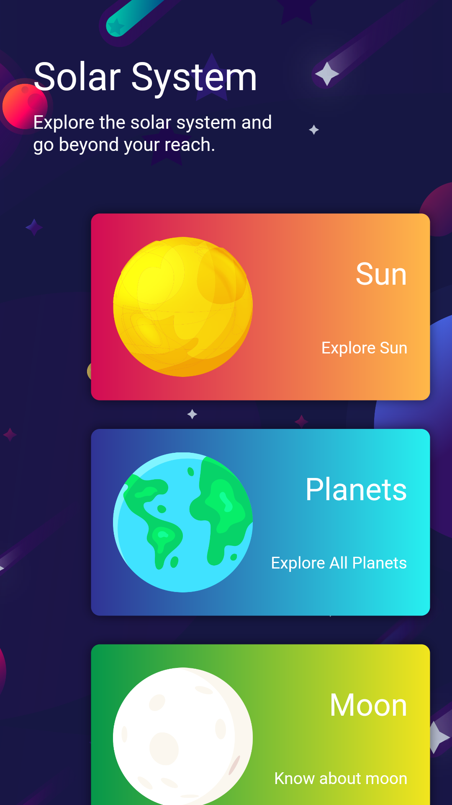
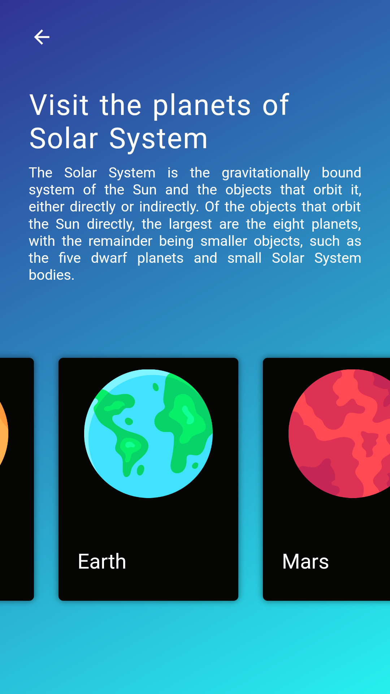
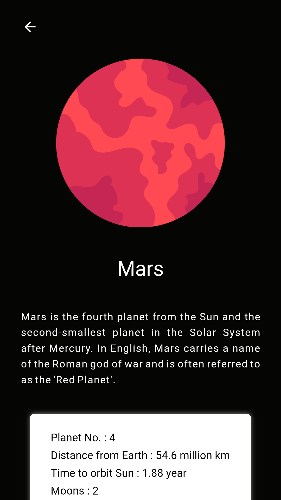
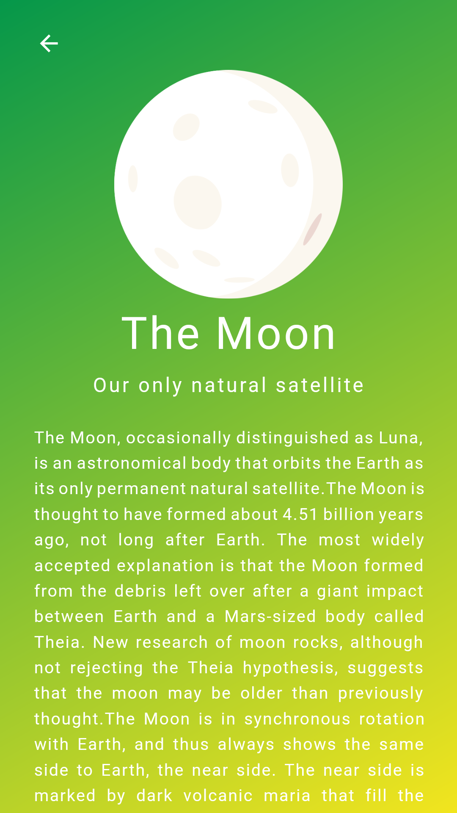
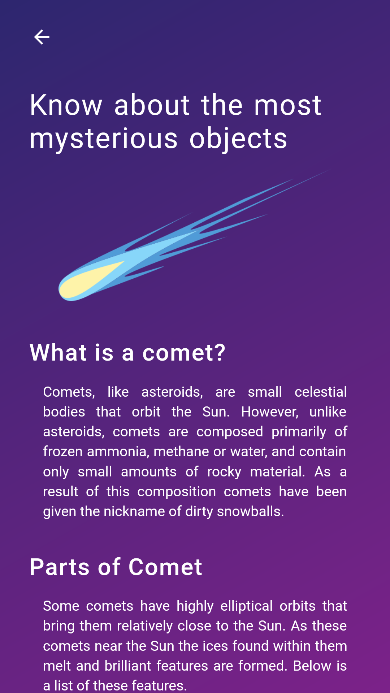
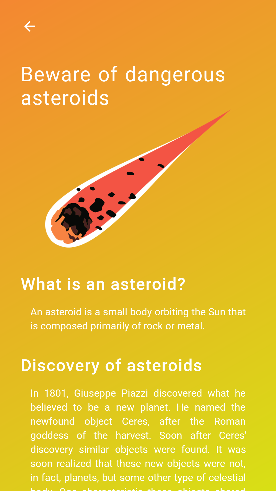

<h1 align="center">
   ⭐ Solar System ⭐  
</h1>
<h4 align="center">
  Built with ❤︎ by
  <a href="https://github.com/noobcoder17">Akash Debnath</a>
</h4>
This is my first project on Flutter. I made a simple solar system app which provides basic information abut our solar system. I think it is useful for kids.
 
For this project is have used Flutter and for managing internal data I have used Providers Package.

  
  
   

  
  
   

  

